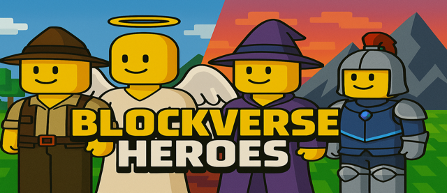
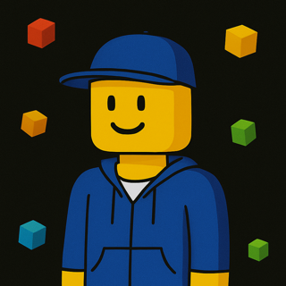
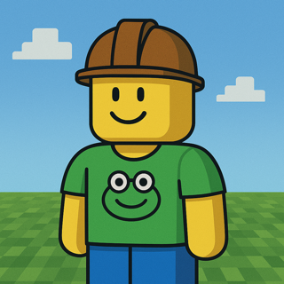
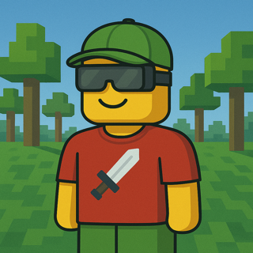
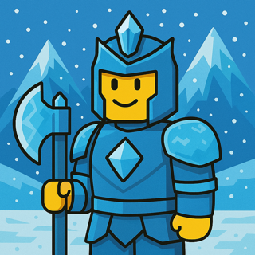
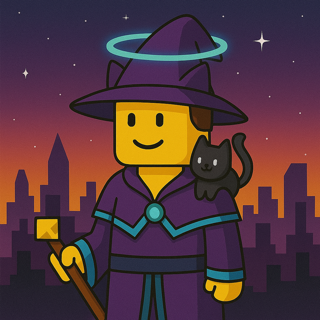

# 🧱 BlockVerse Heroes

Коллекция NFT, вдохновлённая эстетикой Roblox, Minecraft и Lego — с кубическими авантюристами на фоне пиксельных миров.

## 🌐 Демо-сайт
Открой сайт-визитку коллекции на GitHub Pages:  
👉 [Сайт](https://3069603.github.io/blockverse/)

## 📦 Содержимое репозитория

| Файл           | Назначение                                |
|----------------|-------------------------------------------|
| `index.html`   | Основной HTML-файл сайта-визитки          |
| `styles.css`   | Стилизация страницы в стиле коллекции     |
| `banner.png`   | Баннер с героями коллекции                |
| `avatar.png`   | Аватар коллекции (иконка сайта)           |
| `nft1.png` – `nft4.png` | Примеры NFT из коллекции         |

## 🖼️ Превью

### 🔹 Баннер:

### 🔹 Аватар:

### 🔹 Примеры NFT:

  
  
  
  

## 📲 Ссылки

- 🌐 **[Коллекция на Getgems](https://getgems.io/blockverse)**  
- 💬 **[Контакт в Telegram](https://t.me/by3069603$0)**
